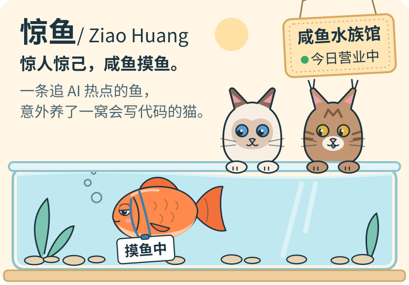
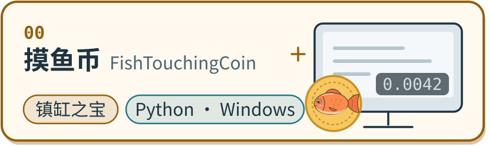
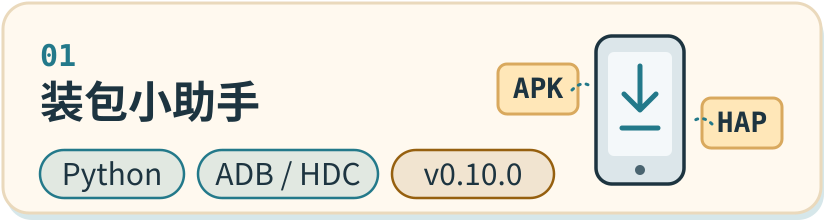
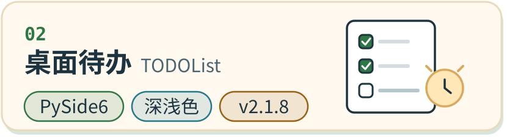

  <picture>
    <source media="(prefers-color-scheme: dark)" srcset="assets/hero-dark.svg">
    
  </picture>

## 🐟 你好，我是惊鱼

- ~~西电本科无敌鶸~~ 人工智能背景，Python 持续学习中
- 🐮🐴 引望牛马一枚；工位之外，认真 vibe coding
- 2022.12.05 第一次打开 ChatGPT，从此没再上岸
- 信第一性原理：能少一层就少一层；好看也算功能

  <picture>
    <source media="(prefers-color-scheme: dark)" srcset="assets/divider-dark.svg">
    
  </picture>

## 🫧 鱼缸里养着的小东西

<a href="https://github.com/amazing-fish/FishTouchingCoin">
  <picture>
    <source media="(prefers-color-scheme: dark)" srcset="assets/project-coin-dark.svg">
    
  </picture>
</a>

按时薪给摸鱼计价。平时只是桌角一个暗灰色小数字，旁人看不出它是什么。
习性：`F9` 秒藏，藏起来照常计费。

<a href="https://github.com/amazing-fish/install_new_apk_hap">
  <picture>
    <source media="(prefers-color-scheme: dark)" srcset="assets/project-apk-dark.svg">
    
  </picture>
</a>

扫一眼文件夹，把最新的 APK / HAP 装进连着的手机，顺手拉崩溃日志。
习性：多台设备排队也不慌，装到一半能喊停。

<a href="https://github.com/amazing-fish/TODOList">
  <picture>
    <source media="(prefers-color-scheme: dark)" srcset="assets/project-todo-dark.svg">
    
  </picture>
</a>

蹲在托盘里的轻量待办：截止时间、到点提醒、一键推迟，跟着系统换深浅色。
习性：「忽略」只是不催了，不会偷偷删你的任务。

<a href="https://amazing-fish.github.io/CodeX-YI/">
  <picture>
    <source media="(prefers-color-scheme: dark)" srcset="assets/project-yi-dark.svg">
    
  </picture>
</a>

[CodeX-YI](https://github.com/amazing-fish/CodeX-YI)：三钱起卦、六十四卦方图，附王弼本经传原文，自动标出该读哪一爻。
习性：卦象数据不对宁可不显示；[点开就能用](https://amazing-fish.github.io/CodeX-YI/)，fork 自 [jiao-ling/CodeX-YI](https://github.com/jiao-ling/CodeX-YI)。

<a href="https://github.com/amazing-fish/dsh-plugins">
  <picture>
    <source media="(prefers-color-scheme: dark)" srcset="assets/project-dsh-dark.svg">
    
  </picture>
</a>

[dsh-plugins](https://github.com/amazing-fish/dsh-plugins)：给 [DeepSeek Harness](https://github.com/deepseek-ai/deepseek-harness) 做的小插件，有能拖动的四格便签，还能让 `/web` 模糊匹配到 `coding-web-search`。
习性：DSH 一升级就跟着适配；也把 [琴键导航](https://github.com/hjj345/dsh-sm-context-piano) [fork 过来](https://github.com/amazing-fish/dsh-sm-context-piano)适配到了 0.1.7，其中轨道自适应那处改动已[合入上游](https://github.com/hjj345/dsh-sm-context-piano/pull/3)。

## 🐱 猫窝值班表

猫窝是从 [上游 Clowder AI](https://github.com/zts212653/clowder-ai) fork 来的（[我的 fork](https://github.com/amazing-fish/clowder-ai)）。猫不是我生的，我负责喂粮和验收。

| 谁 | 负责 |
| --- | --- |
| 布偶猫 | 定方向 |
| 缅因猫 | 动手写 |
| 两只猫 | 互相挑刺 review |
| 🐟 | 拍板和验收 |

  <picture>
    <source media="(prefers-color-scheme: dark)" srcset="assets/divider-dark.svg">
    
  </picture>

## 🍤 鱼食配方

  <picture><source media="(prefers-color-scheme: dark)" srcset="assets/badge-python-dark.svg"></picture>
  <picture><source media="(prefers-color-scheme: dark)" srcset="assets/badge-typescript-dark.svg"></picture>
  <picture><source media="(prefers-color-scheme: dark)" srcset="assets/badge-javascript-dark.svg"></picture>
  <picture><source media="(prefers-color-scheme: dark)" srcset="assets/badge-agent-dark.svg"></picture>
  <picture><source media="(prefers-color-scheme: dark)" srcset="assets/badge-uiux-dark.svg"></picture>

## 🌡️ 水质检测报告

  <picture>
    <source media="(prefers-color-scheme: dark)" srcset="https://github-readme-stats-jiaolings-projects.vercel.app/api?username=amazing-fish&show_icons=true&bg_color=16303F&title_color=F2C96B&text_color=EAF2F5&icon_color=6CC3CF&border_color=2D5163&cache_seconds=21600&v=20261001">
    
  </picture>

  <picture>
    <source media="(prefers-color-scheme: dark)" srcset="https://github-readme-stats-jiaolings-projects.vercel.app/api/top-langs/?username=amazing-fish&layout=compact&bg_color=16303F&title_color=F2C96B&text_color=EAF2F5&icon_color=6CC3CF&border_color=2D5163&cache_seconds=21600&v=20261001">
    
  </picture>

  <picture>
    <source media="(prefers-color-scheme: dark)" srcset="assets/footer-dark.svg">
    
  </picture>

  游过路过，欢迎来鱼缸边聊 Agent、小工具和任何好玩的点子 
  📮 <a href="mailto:huangziao99@126.com">huangziao99@126.com</a> 
  今日也在认真摸鱼 🐟

